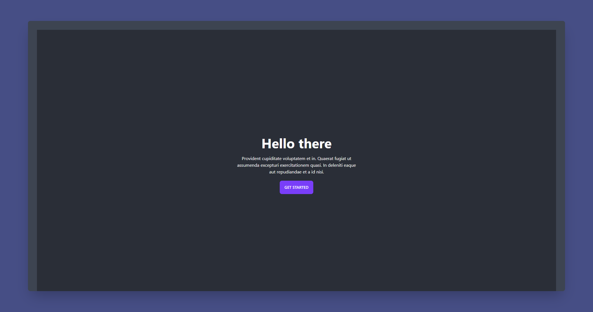
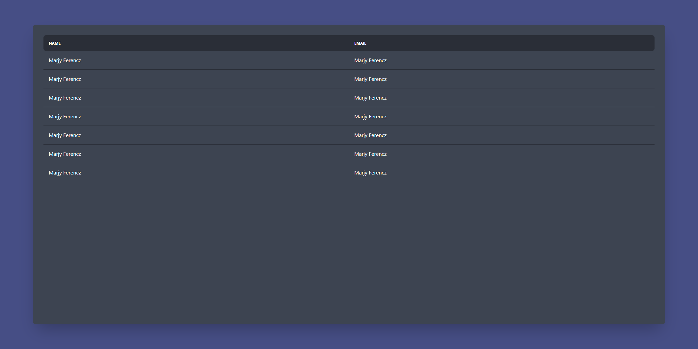

# Template components

This is a detailed list of all the components available on this template.

## **Hero**



You can setup any of the following props

<table>
  <tbody>
    <tr>
      <th>Prop</th>
      <th>Type</th>
      <th>Description</th>
      <th>Required</th>
      <th>Default</th>
    </tr>
    <tr>
      <td>title</td>
      <td>String</td>
      <td>Hello there</td>
      <td align="center">✅</td>
      <td align="center">"Title"</td>
    </tr>
   <tr>
      <td>body</td>
      <td>String</td>
      <td>You can pass a reference to a defined state key or a static text.</td>
      <td align="center">⬛</td>
      <td align="center">-</td>
    </tr>
    <tr>
      <td>actionText</td>
      <td>String</td>
      <td>You can pass a reference to a defined state key or a static text.</td>
      <td align="center">⬛</td>
      <td align="center">-</td>
    </tr>
    <tr>
      <td>action</td>
      <td>String</td>
      <td>You can reference one of your defined actions or an inline function</td>
      <td align="center">⬛</td>
      <td align="center">-</td>
    </tr>
  </tbody>
</table>

example:

```
{
  component: "Table",
  props: [
    {
      prop: "rows",
      value: "items",
    },
    {
      prop: "headers",
      value: "headers",
    },
  ],
}
```

## **Table**



You can setup any of the following props

<table>
  <tbody>
    <tr>
      <th>Prop</th>
      <th>Type</th>
      <th>Description</th>
      <th>Required</th>
      <th>Default</th>
    </tr>
    <tr>
      <td>rows</td>
      <td>Array</td>
      <td>You can pass a reference to a defined state key or a static text.</td>
      <td align="center">✅</td>
      <td align="center">[ ]</td>
    </tr>
    <tr>
      <td>headers</td>
      <td>Array</td>
      <td>You can pass a reference to a defined state key or a static text.</td>
      <td align="center">✅</td>
      <td align="center">[ ]</td>
    </tr>
  </tbody>
</table>

Example:

```
{
  component: "Table",
  props: [
    {
      prop: "rows",
      value: "items",
    },
    {
      prop: "headers",
      value: "headers",
    },
  ],
}
```